# 1.安装部署说明

### 1.1 下载Java11

本项目开发环境为java11

### 1.2 下载适合Java的IDE以及Maven

本项目使用IDEA进行开发，有些IDE可能会自带Maven，如果没有Maven需要先下载Maven包管理工具。打开命令行输入 ```mvn -version``` 查看是否安装Maven。

### 1.3 运行项目

在IDEA下的运行配置

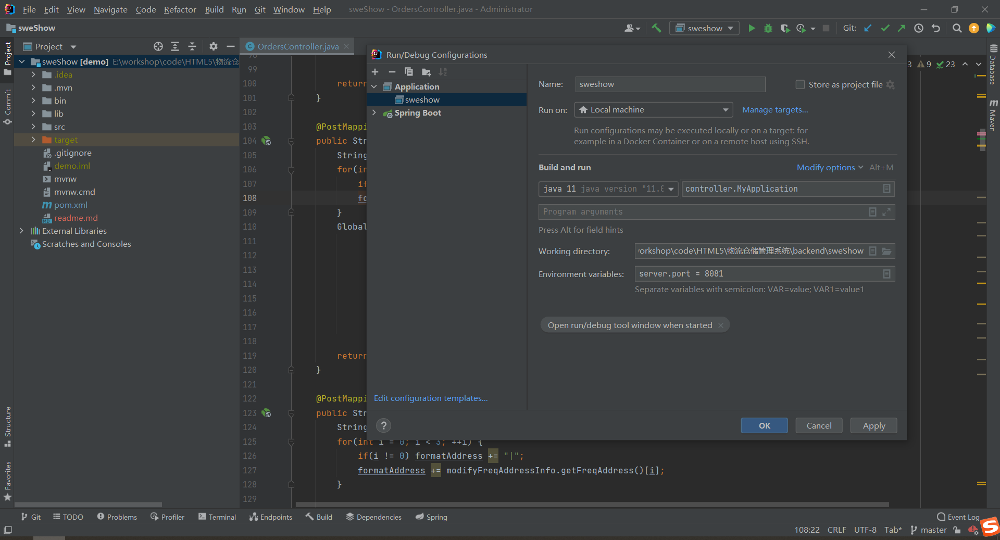


# 2.项目结构说明

### 2.1 根目录下说明

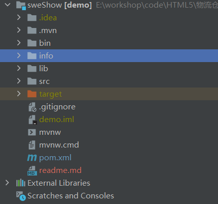

1. lib文件夹：项目开发用到的第三方包放在lib文件夹中

2. src文件夹：项目开发的具体内容位于src文件夹中

3. target文件夹：使用Maven打包项目后会在该文件夹中生成jar包或war包
4. pom.xml文件：描述项目中的包依赖，项目打包时哪些包需要打包的文件
5. 其它文件和文件夹：项目维护阶段暂时不需要修改

### 2.2 根目录下的src下的说明

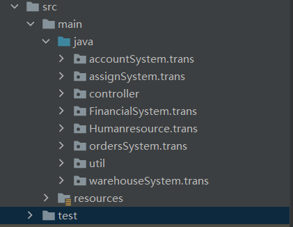

1. accountSystem.trans文件夹：用户管理系统数据结构描述
2. assignSystem.trans文件夹：调度管理系统数据结构描述
3. controller文件夹：总控制逻辑
4. FinancialSystem.trans文件夹：财务管理系统数据结构描述
5. Humanresource.trans文件夹：人事管理系统数据结构描述
6. ordersSystem.trans文件夹：订单管理系统数据结构描述
7. util文件夹：提供工具类的文件夹
8. warehouseSystem.trans文件夹：仓库管理系统数据结构描述

### 2.3 用户管理系统下的说明

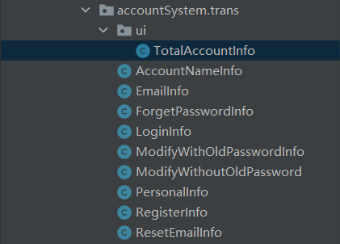

1. RegisterInfo：用户注册时前端发送和后端接收的信息的结构的描述。前端发送时的字段应和该文件保持一致（即发送过来的对象中应包含该文件描述的属性）
2. LoginInfo：用户登录时的信息的结构描述
3. emailInfo：用户注册时点击发送验证码时的信息的结构描述

4. forgetPasswordInfo：用户忘记密码时的发送验证码的信息的结构描述

​	...

**注：**

通过用户管理系统来举例说明。实际上这些描述信息可以更便捷地查看，在controller文件夹中，选择对应模块的控制文件，在指定接口中查看。 


在controller文件夹下选择对应的控制模块，比如仍然打卡用户管理模块文件AccountController，然后随意选择一个接口函数，即可查看描述类。下述接口函数中描述了描述类emailInfo，用于邮箱验证码发送时的信息描述

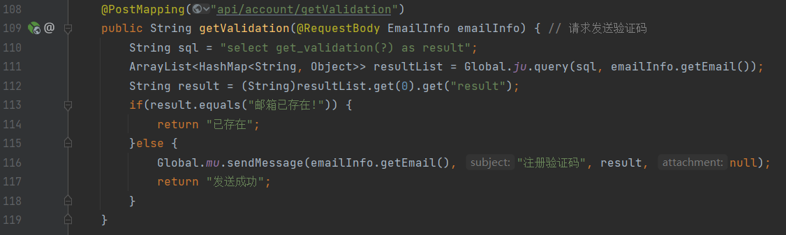

### 2.4 controller文件夹下的说明

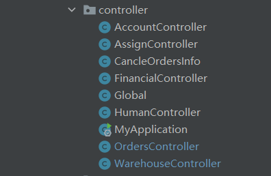

1. AccountController：用户管理模块逻辑
2. AssignController：调度管理模块逻辑
3. CancleOrdersInfo：取消订单的信息描述 **（这放错文件夹了，应该在外层的ordersSystem.trans中）**

4. FinancialController：财务管理模块逻辑
5. Global：项目中自定义的全局变量的描述

6. HumanController：人事管理模块逻辑
7. MyApplication：项目入口逻辑
8. OrdersController：订单管理模块逻辑
9. WarehouseController：仓库管理模块逻辑


# 3.接口开发说明

### 3.1 接口开发的位置

在上文中已经提到了项目的逻辑编写位于src/controller文件夹下，如果要新增一个模块的接口，那么应该在该文件夹下创建新的文件

### 3.2 接口开发的说明


1. @PostMapping注解：函数前加上该注解表示用于接收方法是Post的Http请求。括号里的路径表示接口的路径。如果服务器地址是http://39.96.175.246:8888，那么在浏览器中地址栏输入http://39.96.175.246:8888/api/account/getValidation就相当于访问该接口，该接口函数将被执行。在地址栏输入该路径相当于发送http请求，当然还有其它很多方法发送http请求。

2. 函数名与函数类型：函数名自定义即可，函数类型看该接口返回什么信息就可以
3. 函数参数：@RequestBody注解表示将前端发送的字符串信息解析，解析成对应的类类型，在该函数中被解析成EmailInfo类型。

4. 数据库查询：Global.ju.query是工具类中提供的查询类，可以模仿项目中的查询语句进行编写
5. 返回语句：返回一个任意类型皆可，框架会帮助你转化格式并发送给前端

### 3.3 前后端结合来理解接口开发

#### 3.3.1 前端发送验证码请求

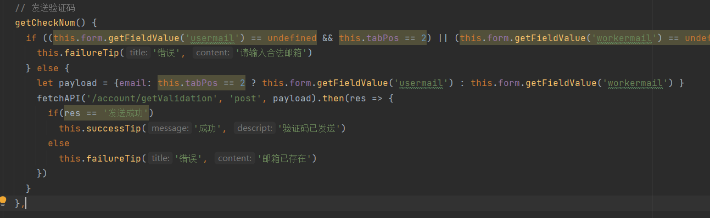

#### 3.3.2 后端EmailInfo

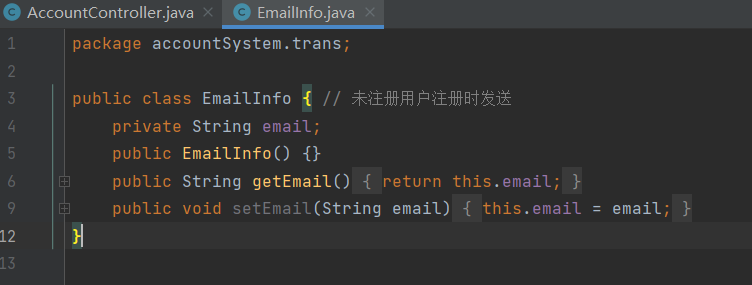

#### 3.3.3 后端验证码发送接口


1. 先看EmailInfo文件，在前后端接口开发前应该先规定该文件，该文件说明了前端向后端请求验证码信息时应发送一个对象，如下```{email: "1418406055@qq.com"}``` ，只有后端接收到类似这样的信息时才会处理
2. 再看前端接口，前端使用payload对象描述信息，只有一个email字段，符合EmailInfo的要求。之后再使用fetchAPI接口发送请求，其中描述了使用post请求，路径是“服务器路径” + "/account/getValidation"。其中服务器路径会在fetchAPI接口中自动加上。
3. 再看后端接口，后端使用@PostMapping注解，描述了接收post类型的请求，描述了接口路径是“服务器路径” + "/api/account/getValidation"，与前端发送的请求的路径一致。

4. 再看后端接口，函数中逻辑处理完毕后会返回一个字符串“发送成功”或“已存在”。再看前端接口，fetchAPI会等待服务端响应，使用then函数描述了接收到这两种字符串后的响应动作。


# 4.服务端部署说明

### 4.1 安转第三方包到本地Maven仓库

#### 4.1.1 为什么要安装到本地仓库：

如果仅仅在本地运行，那么就不需要此操作。如果要打包后部署到服务器，那么需要用到Maven，Maven在处理包依赖时，会在本地仓库和网络公共仓库寻找包，并把这些包打包到你的项目中。但是当你引入了第三方包时，放在了lib文件夹中，在项目中可以直接引用/lib文件夹中的包，但是这些包不在Maven本地或公共仓库中，此时你需要将这些包放入本地Maven仓库。

#### 4.1.2 安装指令

用maven把第三方jar包安装到本地maven仓库，指令格式如下:
```mvn install:install-file -Dfile=<path-to-file> -DgroupId=<group-id> -DartifactId=<artifact-id> -Dversion=<version> -Dpackaging=<packaging>```
Dfile表示jar包的路径
DgroupId可以自定义
DartifactId可以自定义
Dversion可以自定义

**安装第三方包：**

这个是我的项目在本地的路径，E:\workshop\code\HTML5\物流仓储管理系统\backend，在不同的计算机上要注意修改。

在当前项目路径下的命令行依次输入下述指令，可以在IDEA中通过terminate快速打开命令行。

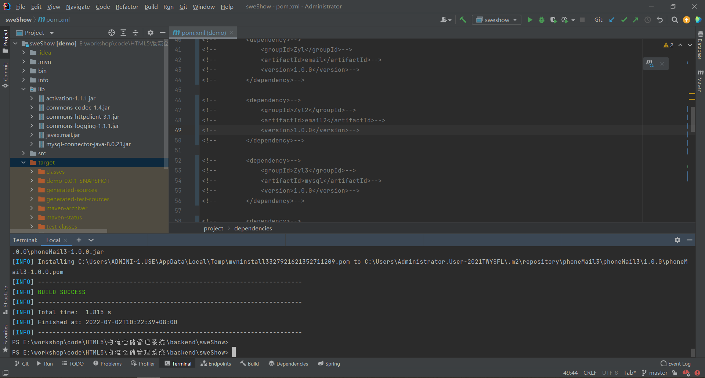

```mvn install:install-file -Dfile=E:\workshop\code\HTML5\物流仓储管理系统\backend\sweShow\lib\activation-1.1.1.jar -DgroupId=Zyl -DartifactId=email -Dversion="1.0.0" -Dpackaging=jar```

```mvn install:install-file -Dfile=E:\workshop\code\HTML5\物流仓储管理系统\backend\sweShow\lib\javax.mail.jar -DgroupId=Zyl2 -DartifactId=email2 -Dversion="1.0.0" -Dpackaging=jar```

```mvn install:install-file -Dfile=E:\workshop\code\HTML5\物流仓储管理系统\backend\sweShow\lib\mysql-connector-java-8.0.23.jar -DgroupId=Zyl3 -DartifactId=mysql -Dversion="1.0.0" -Dpackaging=jar```

```mvn install:install-file -Dfile=E:\workshop\code\HTML5\物流仓储管理系统\backend\sweShow\lib\commons-codec-1.4.jar -DgroupId=phoneMail1 -DartifactId=phoneMail1 -Dversion="1.0.0" -Dpackaging=jar```

```mvn install:install-file -Dfile=E:\workshop\code\HTML5\物流仓储管理系统\backend\sweShow\lib\commons-httpclient-3.1.jar -DgroupId=phoneMail2 -DartifactId=phoneMail2 -Dversion="1.0.0" -Dpackaging=jar```

```mvn install:install-file -Dfile=E:\workshop\code\HTML5\物流仓储管理系统\backend\sweShow\lib\commons-logging-1.1.1.jar -DgroupId=phoneMail3 -DartifactId=phoneMail3 -Dversion="1.0.0" -Dpackaging=jar```


### 4.2 后端项目打包

#### 4.2.1 修改包管理文件

将根目录下的pom.xml文件中的注释去掉，在该文件中已经注释了，这些被注释掉的代码的功能（就是用于打包）

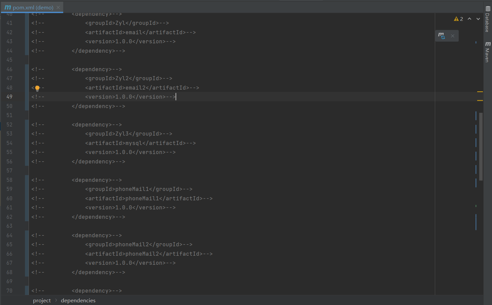

#### 4.2.2 使用Maven打包

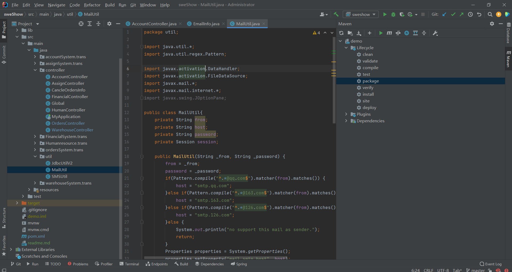

使用Maven对项目打包。此时以IDEA为例，点击右侧的Maven展开右边栏，选择LifeCycle，先点击clean（把之前的打包文件清除），再点击package（开始打包）。如果出现错误，可能是有些包出现了问题，需要使用Maven重新安装。如果成功，那么在根目录下的target文件中找到打包后的文件。

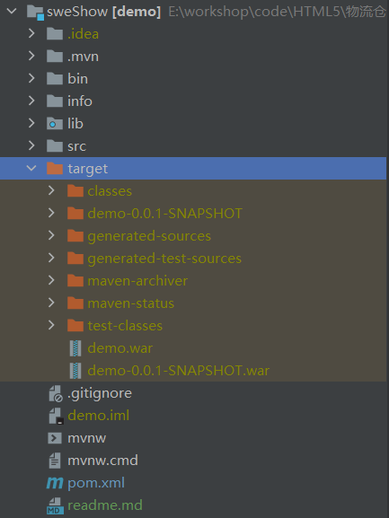

上图展示了打包文件，打包了两个war文件（可以在pom.xml文件中修改配置来决定打包成jar或war文件），选择名字较长的那一个部署即可。


### 4.3 文件上传到服务器

#### 4.3.1 上传文件

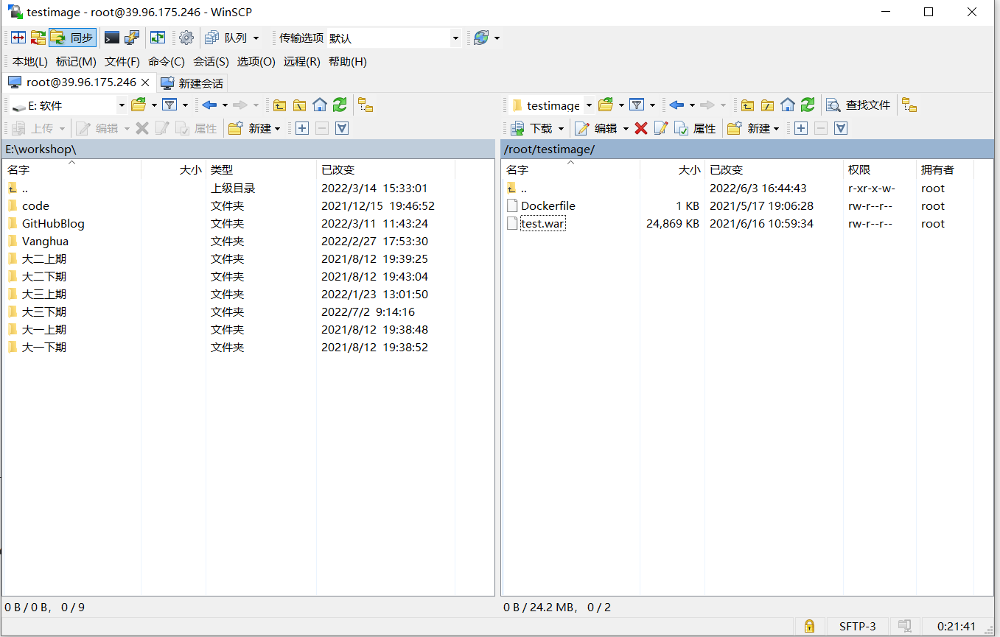

举例来说，将文件通过winscp软件（也可以通过其它软件上传）上传到服务器的/root/testimage文件夹中 **（只关注右侧即可，左侧是本地打开文件）**。将刚刚获取的demo.war改名为test.war。

#### 4.3.2 编写Docker镜像制作文件

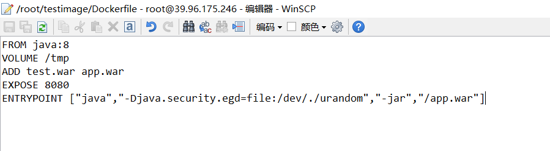

计划为后端项目提供一个独立的环境运行，我们使用Docker来将它制作成一个Docker镜像文件，使其未来能运行在Docker提供的独立封闭环境中。DockerFile的编写可以在网上查找资料，有专门的说明。在此给出该DockerFile的编写。


### 4.4 Docker镜像制作与部署

#### 4.4.1 Docker镜像制作

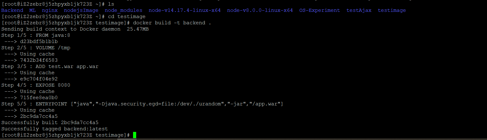

在此举例，使用putty连接服务器（也可以用其它软件连接）。进入testimage文件夹（刚刚我们把项目保存到这里了）。输入```docker build -t backend .``` 指令，将后端文件打包成镜像，镜像名称是backend。

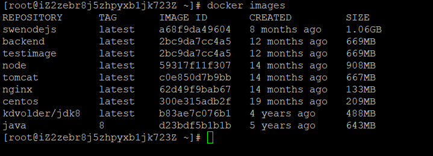

打包成镜像之后输入指令 ```docker images``` 查看，可以看到已经有打包好的镜像backend

#### 4.4.2 镜像部署与运行

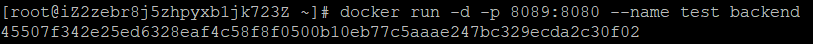

输入指令，使镜像运行成为一个独立的容器。docker run指令指的是使镜像运行，-d表示指定backend镜像。-p表示端口映射，访问服务器的8089端口即可访问后端项目，8080表示后端项目在容器中运行时与外界通信的端口，该端口的指定有DockerFile指定（可以查看上文DockerFile文件）。--name表示的是容器名称。

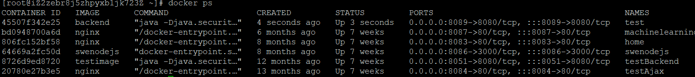

输入指令 ```docker ps``` 查看正在运行的容器，可以看到第一个容器test就是我们刚刚运行的容器。

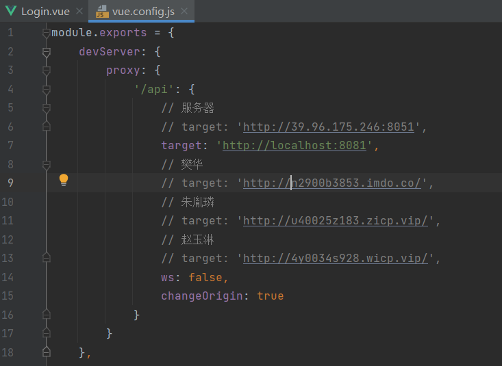

此时后端项目部署完成，需要改变前端项目中服务器地址的配置。在前端项目中修改vue.config.js文件。将target修改为指定地址，假如服务器地址是http://39.96.175.246。那么target为http://39.96.175.246:8089。

#### 4.4.3 开启防火墙

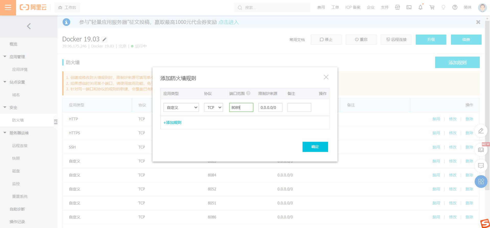

本项目使用阿里云远程服务器，在防火墙中开启8089端口，允许访问即可。


# 5.前端部署说明

### 5.1 打包项目

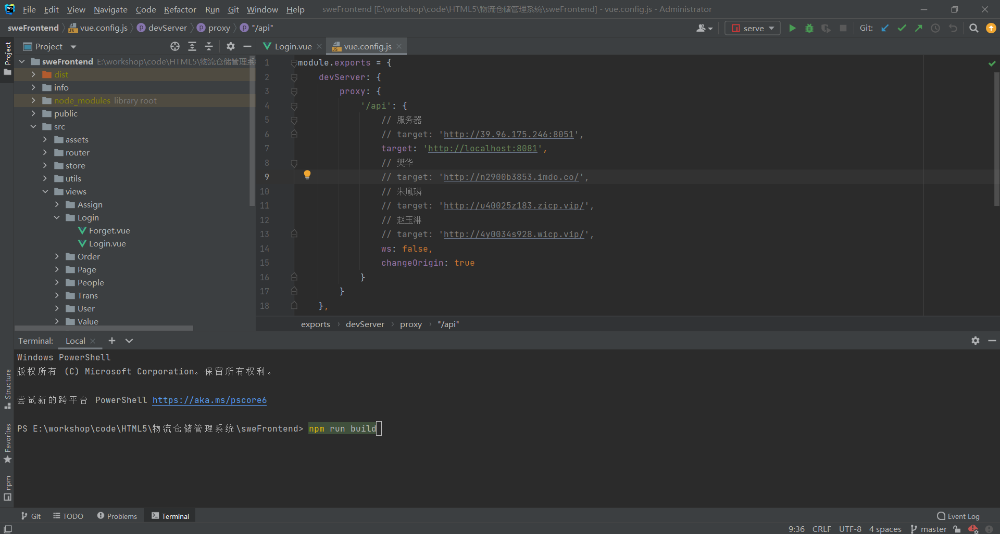

此时用webstorm做演示，在当前项目的路径下打开命令行，输入 ```npm run build``` 指令，开始打包项目。

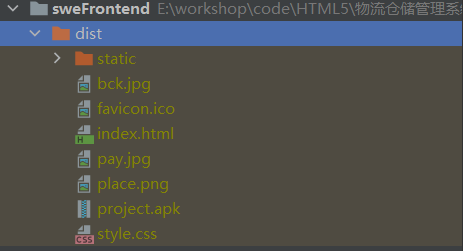

打包完成后查看dist文件夹，dist文件夹中的内容就是要部署的内容。其中project.apk不是打包生成的，是之前项目打包成的安卓软件。

### 5.2  上传服务器


上传到nginx目录下的www文件夹中。这个nginx文件夹时自己建立的，需要有conf，www，logs文件夹，conf中有nginx配置文件，可以配置nginx服务器信息（nginx服务器负责前端页面访问和将前端请求转发给后端服务器）。conf文件的配置可以参考网络教程。在后期维护过程中，将新打包的文件直接覆盖到www文件夹即可。

### 5.3 docker镜像部署与运行

#### 5.3.1 检查nginx镜像

前提：已经下载好了nginx镜像

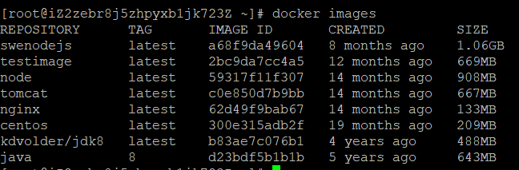

输入指令，检查是否安装了nginx镜像，上图显示已经安装了nginx镜像。如果没有安装则查找linux下安装nginx的docker镜像的教程。

#### 5.3.2 运行镜像

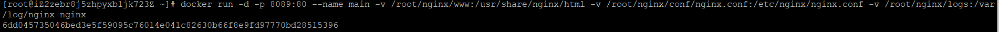

输入指令（下面是假设把前端文件放在了）

```docker run -d -p 8089:80 --name main -v /root/nginx/www:/usr/share/nginx/html -v /root/nginx/conf/nginx.conf:/etc/nginx/nginx.conf -v /root/nginx/logs:/var/log/nginx nginx```

-v表示挂载，我们刚刚已经把前端项目放在了nginx文件夹下的www中，并且也创建了conf文件夹和logs文件夹。此时表示将刚刚创建的文件夹挂载到下载的nginx的docker镜像运行后产生的容器中。nginx的docker镜像中也有对应的三个文件夹，挂载之后，修改/root/nginx文件夹的内容，就可以修改docker容器中的内容。这样做的好处时，每次修改项目之后只需要将打包文件复制到/root/nginx/www目录下即可，不需要重新用镜像打包成一个docker容器。这个做法可以对比后端文件的部署，后端文件如果发生了变化，我们必须要重新将它打包成docker镜像，但是前端项目只需要一次粘贴就可以更新。

-d，-p和--name已经在后端项目的部署中已经介绍过了。

#### 5.3.3 检查镜像

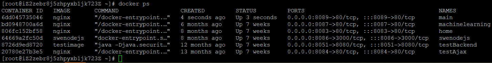

输入 ```docker ps``` 指令，查看正在运行的镜像，可以看到，第一个main容器就是正在运行的nginx镜像。此时部署成功。

#### 5.3.4 开启防火墙

开启防火墙的方法上文已经介绍过了，此处不再赘述。